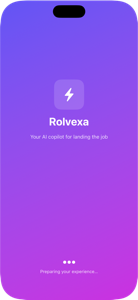

# Rolvexa



**An offline resume parser, analyser and document generator for iOS.** Rolvexa reads a resume from a PDF, a Word file or a photo, scores it, compares it against a job posting, and regenerates it as a styled PDF or Word document — entirely on-device, with no cloud AI and no network access at any point.

### What's interesting under the hood

- **Reading-order reconstruction.** Recursive XY-cut page segmentation over Vision OCR output, so a two-column or sidebar resume extracts in the order a person reads it rather than the order the OCR engine emits. Choosing the split axis by recursion depth matters: the gutter *inside* a job entry is wider than the gap *between* two jobs, so "widest gap wins" cuts in the wrong place.
- **Documents written from primitives.** PDFs are drawn with CoreText/CoreGraphics; `.docx` files are hand-authored OOXML packed by a ZIP writer with its own CRC-32, down to an embedded JPEG cropped to a circle by a DrawingML shape preset. No document libraries.
- **Explainable scoring.** Job fit is set arithmetic you can argue with, not a generated number — every percentage traces back to a count of matched and missing terms, and a dimension the posting is silent about is dropped rather than guessed at.
- **Deterministic first, model second.** The on-device language model only ever rephrases, behind a check that rejects any rewrite altering a number. Spelling and grammar never touch it: a rules engine can't autocorrect someone's surname into a different word.

**114 tests · no third-party dependencies · no network calls · ~7.7k lines of Swift**

## What it does

Rolvexa supports two ways to start:

- **Upload an existing resume** (PDF, Word, or a photo/screenshot) — get an instant score, a breakdown (ATS compatibility, content & impact, grammar & clarity, formatting), and concrete suggestions for improving it. Photos are read with on-device OCR, so a picture of a printed resume becomes fully editable, fixable, and exportable as a real PDF or Word document.
- **Write a resume from scratch** — enter your contact details and profile links, the job you're targeting, each role you've held (title, employer, location, dates, achievement bullets), and your education. Write your own summary or let Rolvexa generate one. Add an optional headshot and it's rendered as a circular photo in the sidebar template.

From there, Rolvexa:

- Picks a professional template (Modern Edge, Minimal Pro, Creative Bold, Executive Suite) — or keeps your uploaded file's original layout untouched if you'd rather not restyle it.
- Scores your resume and flags issues: spelling, weak passive phrasing ("responsible for" → "Led"), repeated words, missing sections, missing quantifiable metrics, and more.
- **Job fit** — paste a job posting and Rolvexa compares it against your resume: which required skills you already cover, which are missing, and how you score on skills, recurring terms, seniority and education. Every figure is traceable to a count, so the number can be argued with. Without a posting it reports a *resume score* and says so, rather than implying a match it hasn't measured.
- **"Fix It For Me"** — applies safe, deterministic fixes automatically, and on Apple Intelligence devices also rewrites bullet points and paragraphs for punchier phrasing (never inventing facts, numbers, or achievements that aren't already there).
- Suggests other job titles you're a good fit for, based on your skills.
- Generates a tailored cover letter and a job-fit analysis alongside your resume.
- Exports everything as PDF or Word, ready to send — matching the on-screen preview section for section, including the contact icons, the photo, and a coloured sidebar that runs the full height of every page.

Where a field is missing, Rolvexa leaves the section out rather than filling it with sample text. A resume that's visibly incomplete is recoverable; one that's confidently wrong about who you are is not.

## How it works, technically

Everything runs locally on the device — no cloud AI, no API keys, no network calls:

- **Text extraction** from uploaded files: `PDFKit` for text-based PDFs, a minimal in-house zip reader (with `Compression` for inflate) for DOCX, and `Vision` OCR for photos, screenshots, and scanned image-only PDFs. Photos are normalized upright first — a camera photo stores its rotation in an EXIF tag, and Vision reports text positions in the *stored* pixel space, so without normalizing, a sideways photo's sections come out in reverse order.
- **Reading order** is rebuilt by recursively bisecting the page along the widest text-free band, alternating axis by depth: a column split at the top level, then row splits within each column. A flat "widest gap wins" rule fails on real resumes, because the gutter between an employer and its bullet list is wider than the gap separating two jobs.
- **Scoring and suggestions** via `NaturalLanguage` tokenization, the system spell checker (`UITextChecker`), and deterministic heuristics.
- **Job-fit matching** weights four dimensions — technical skills (50), recurring terms (25), seniority (15), education (10) — and redistributes the weight of any the posting doesn't mention. Matching is whole-token, so "R" doesn't match *Paris*; `+` and `#` count as token continuations so a posting asking for C++ doesn't also register a requirement for C, while "AWS." at a sentence end still matches. A posting with no recognisable requirement returns no analysis at all rather than a confident 0%.
- **"Fix It For Me"** layers Apple Intelligence's on-device system model — via the [Foundation Models](https://developer.apple.com/documentation/foundationmodels) framework, using `@Generable` guided generation so the response is a guaranteed-shape Swift type rather than parsed free text — on top of the deterministic fixes.
- **Export generation** is written from first principles. PDFs are drawn with CoreText/CoreGraphics (US Letter, multi-page, circular photo via an ellipse clip). `.docx` files are hand-written OOXML packed into a hand-rolled ZIP container, with the headshot embedded as a JPEG part and cropped to a circle by a DrawingML `ellipse` preset. Headshots are normalized through all eight EXIF orientations and centre-cropped square before either renderer sees them.
- Built with **SwiftUI**. No third-party package dependencies.

### Graceful degradation

Apple Intelligence requires capable hardware (A17 Pro or newer). The app checks `SystemLanguageModel.availability` and tiers accordingly:

| Tier | Devices | Capability |
|---|---|---|
| Apple Intelligence | iPhone 15 Pro and newer | Full phrasing rewrites + all of the below |
| Deterministic engine | **All supported devices** | Spelling, weak-verb fixes, scoring, structure analysis |

Spelling and grammar deliberately stay on the deterministic path even where the model is available — a rules engine can't "autocorrect" someone's surname into a different word, which is exactly the kind of silent corruption a resume can't tolerate.

## Tests

```
xcodebuild test -project Rolvexa.xcodeproj -scheme Rolvexa \
  -destination 'platform=iOS Simulator,name=iPhone 17'
```

114 tests ([Swift Testing](https://developer.apple.com/documentation/testing)) over the deterministic core — the parts where a silent mistake reaches the user's actual resume:

| Suite | Covers |
|---|---|
| `JobFitAnalyzerTests` | Scoring and weight redistribution, whole-token matching ("R" must not match *Paris*, C++ must not register C), and refusing to score a posting it can't read |
| `ResumeExportTextTests` | Section order and headings, summary precedence, and that a failed upload invents no content |
| `DocumentExporterTests` | Content parity across all four templates × PDF and Word, no contact block repeated across pages, `.docx` package validity and image embedding |
| `ResumePhotoTests` | All eight EXIF orientations, checked against UIKit rather than against hand-reasoned expectations |
| `ResumeSectionKitTests` | Header detection, section synonyms, keyword extraction and skill mining |

Orientation and content-parity assertions compare against an independent oracle (UIKit, and the rendered PDF's own extracted text) rather than against expected values written by hand, because those are exactly the places where a wrong expectation looks like a passing test.

## Setup

Open `Rolvexa.xcodeproj` in Xcode and build. Nothing else to configure — no model weights to download, no dependencies to resolve.

Minimum deployment target is iOS 18. The Foundation Models code path is gated behind `if #available(iOS 26, *)` and an availability check, so it compiles and runs fine on older systems — it just falls back to the deterministic engine there.
